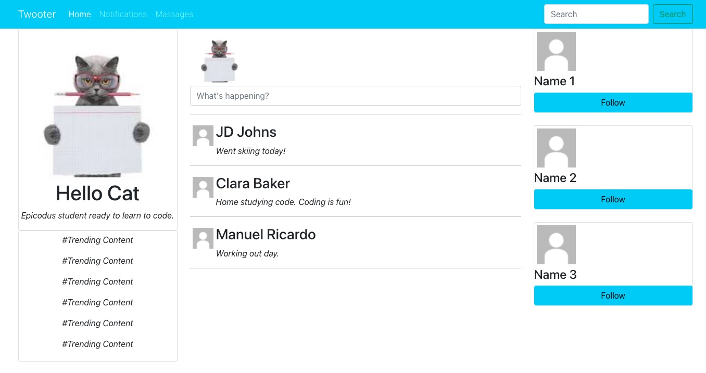
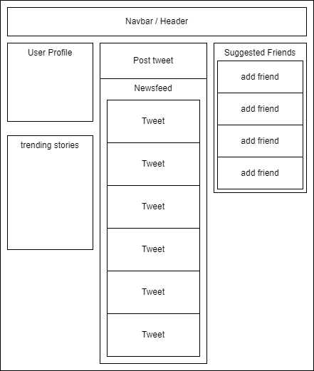

# Social Media Clone
This is a mock up of a social media app.

#### By Karen Axon and Matt Casperson

## Component Diagram 
 

## Technologies Used
* React
* HTML
* NPM
* CSS

## Setup/Installation 
* Click on the [repository's](https://github.com/karenaxon/social-media-clone.git) link.
* Click on the green "Code" button and copy the repository URL.
* Open your terminal and navigate to the location where you would like to clone the application.
* Use the command _git clone https://github.com/karenaxon/social-media-clone.git_ to clone the repository.
* From the root directory of the application, the my-app, run the following commands to install the packages and start the development server:
  - _npm install_
  - _npm run start_
	
* Navigate to `localhost:3000` in your favorite browser to view the website.

## Known Bugs
* None so far

## License

[MIT](https://choosealicense.com/licenses/mit/)

Copyright (c) February 2022 - Karen Axon & Matt Casperson

## Contact Information:

<h3>Karen Axon</h3>

### Matt Casperson

